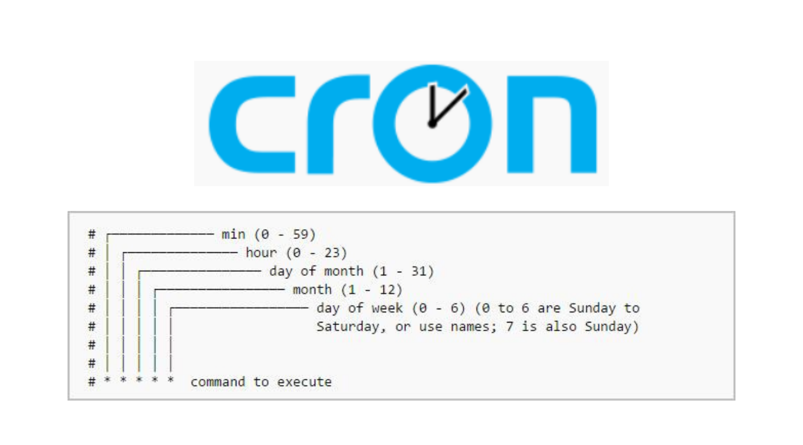

# Price Tracker

A simple Python tool to track product prices on **Amazon** and **Micro Center**

## Features
- Add products URL's with a target price
- Store product details in a SQLite database
- Scrape current price using Selenium
- Send email alerts when prices drop

## Requirements
- Python 3.9+
- Google Chrome

### Python Dependencies
Install them with:
```dockerignore
pip install -r requirements.txt
```

## Setup
1. Clone the repository and navigate to it
2. Open the .env file and add your email details
```dockerignore
SMTP_ADDRESS="smtp.yourmail.com"
EMAIL_ADDRESS="youremail@gmail.com"
EMAIL_PASSWORD="yourapppassword"
```
- Note: In this project, one email serves as both the sender and the receiver.
3. To create an app password:
- Log into your Google account and make sure you have 2FA enabled
- In the search bar, type app password

- Click on _App passwords_, enter a name for your app, and click "Create"
- A 16-character password will be generated. Copy and paste it to **EMAIL_PASSWORD**

## Usage
1. Add products to database
Run:
```dockerignore
python setup_db.py
```
- Choose your marketplace (Amazon, Micro Center)
- Enter product URL, target price, and a nickname
2. Run trackers
Run one of these:
```dockerignore
python scrap_amazn.py
```
or
```dockerignore
python scrap_microcntr.py
```
The script will:
- Open the product page in a headless browser
- Compare the current price with your target price
- Send an email if the current price matches or is lower than the target price

## Notes
- Database: `products.db`
- Tables: `amazon_products`, `microcenter_products`
- Duplicate URLs are skipped

## Linux Cron Job
1. Create a shell script and give it **Execute** permission
```dockerignore
touch tracker.sh
chmod +x tracker.sh
```
Add a shebang line to the script based on the running shell (bash, zsh):
```dockerignore
echo \#\!$SHELL >> tracker.sh 
```
2. Open the shell script and add these lines:
```dockerignore
source /full/path/to/project_directory/.venv/bin/activate   # activate python's virtual environment
python3 /full/path/to/project_directory/scrap_amzn.py       # run the Amazon tracker script
python3 /full/path/to/project_directory/scrap_microcntr.py  # run the Micro Center tracker script
```
Save changes and exit.
3. Ensure the cron daemon is installed and enabled. Run:
```dockerignore
crontab -e
```
You may be prompted to select your desired text editor. Then, add a new job:
```dockerignore
00 12 * * * /full/path/to/your/tracker.sh
```
In the above example, the script will be executed at 12PM every day of the month, every month, every day of the week
4. Learn more about the crontab syntax below:
